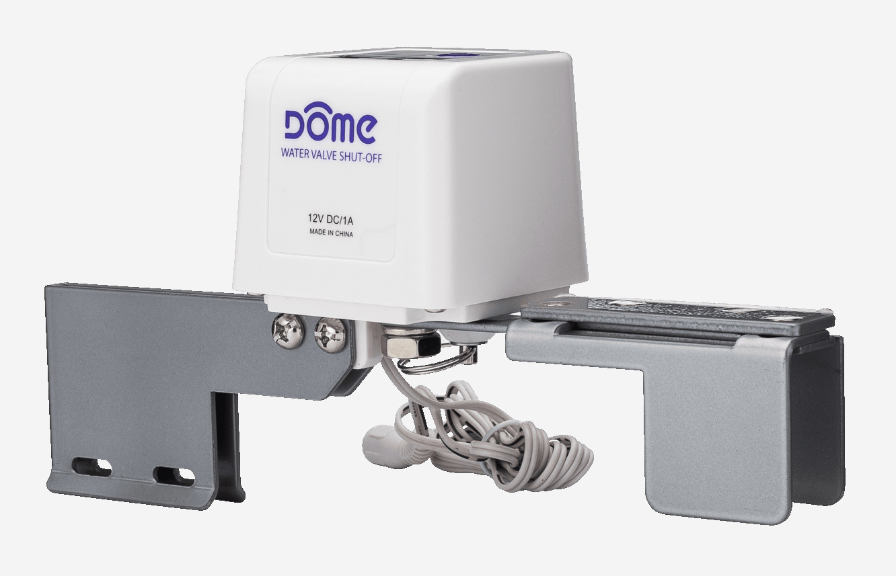

## Project Overview

I was the first hire at Elexa Consumer Products, and played a key role in bringing the Dome product line to market. <!-- end -->My main responsibilities were in product design, documentation, and marketing.

## Product Design and Specification

<image-caption>The Dome Water Main Shut-Off</image-caption>

I joined Elexa shortly before the Dome product line launched. I was responsible for the industrial design for the <a target="_blank" href="https://domeha.com/z-wave-water-main-shut-off-valve">Water Main Shut-Off</a> and the <a target="_blank" href="https://domeha.com/z-wave-door-and-window-sensor-pro">Door/Window Sensor Pro</a>.

Along with physical product design, I specified software functionality for Dome devices. I worked within the Z-Wave spec to maximize functionality without adding to costs. I worked with Sigma Designs to add to the Z-Wave standard to support brand new features. The best examples include pest detection in the <a target="_blank" href="https://domeha.com/z-wave-mouse-trap">Mouser</a> and the <a target="_blank" href="https://domeha.com/z-wave-siren-sensor">Siren's</a> multiple chimes.

## Product Documentation

It was important to integrate Dome with established smart home platforms. I set a goal to create the most detailed and easiest to work with documentation on the market. As a result, Dome secured integration partnerships with manufacturers like Wink, Samsung, and many more.

The docs are <a target="_blank" href="https://docs.domeha.com">available online</a>.

## Digital Marketing

I cultivated the Dome brand's voice and crafted most of the outward facing language. I was a natural fit for the role because of my ability to understand complex ideas and explain it in simple terms. My work can still be seen live on the <a target="_blank" href="https://www.domeha.com">Dome website</a>.
