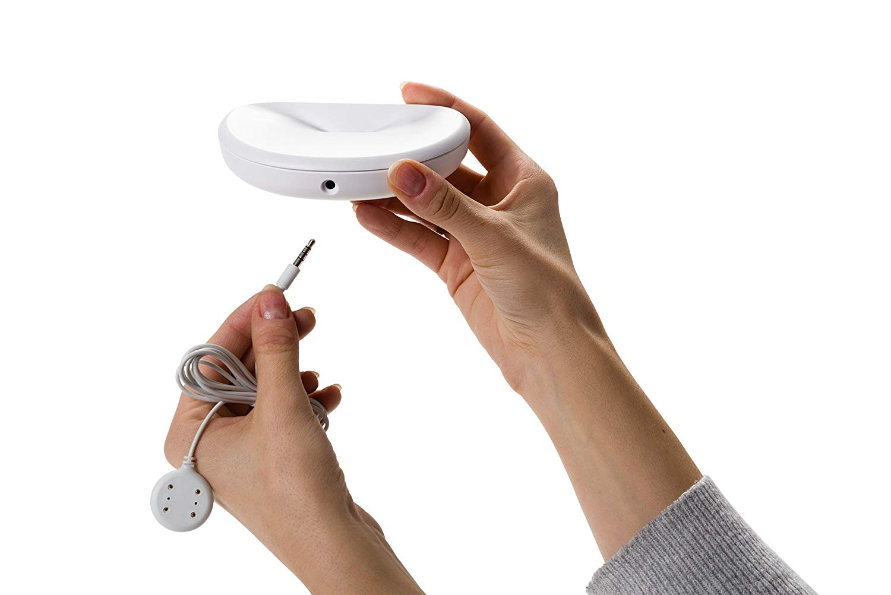

## Project Overview

I designed the Guardian Leak Prevention System, an innovative IOT solution for water damage in homes and businesses. <!-- end -->I played a key role in every stage of the product life-cycle, from initial concepts to product launch. My primary responsibilities were in product design & UX.

We approached the Guardian system from a design-first perspective, putting great effort and thought into making the products easy to install and delightful to use and see.

<image-caption>The Guardian Leak Detector</image-caption>

### Leak Detector

The Guardian Leak Detector is one of my proudest professional and creative achievements. It is arguably the _best_ product of its type, due to several unique features, including its ability to detect as little as three drops of water and monitor the vast majority of household appliances and fixtures for leaks.

### Valve Controller

The Valve Controller includes similarly disruptive features. Most importantly, it installs without any tools in under ten seconds on the most commonly available ball valves on the market. These two factors&mdash;the extreme ease of installation and universal compatibility&mdash;combine to make the Valve Controller a unique product with excellent product-market-fit.
