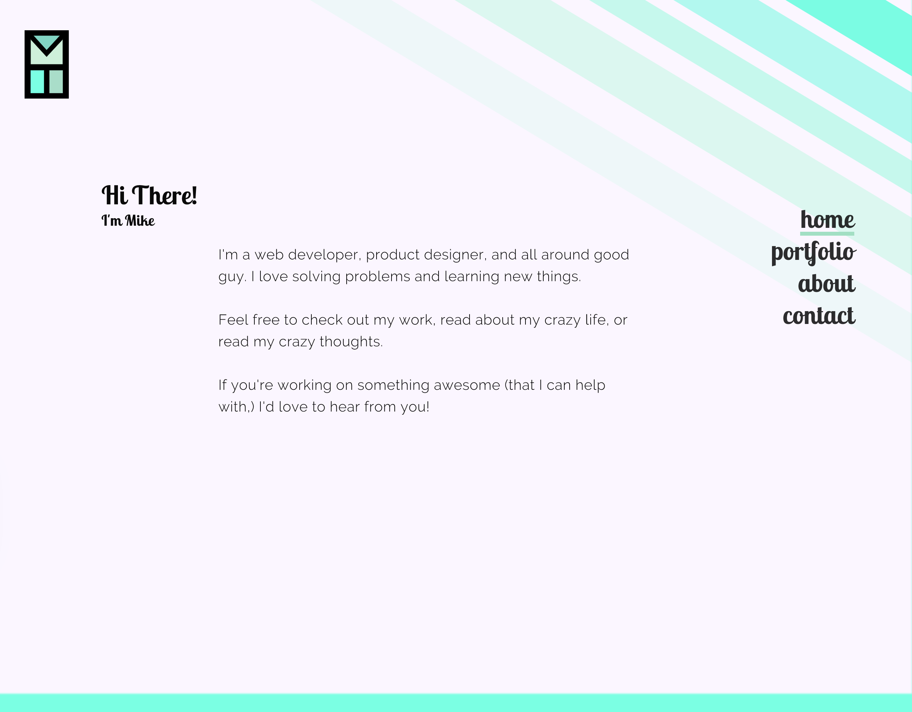

## Project Overview

I wanted my website website to be more than a repository of projects. I wanted it to reflect my capabilities and personality. <!-- end -->I designed and developed the website with no templates or CSS frameworks. I used React and Gatsby for the front end.

## Design

<image-caption>An early mockup of the home page created in Gravit Designer.</image-caption>

As a Linux user, I don't have easy access to typical design software like Sketch or Affinity. I designed using paper and open source software since collaboration wasn't a concern. I used Gravit Designer for the design. It's lightweight and excellent for sketching ideas.

## Stack

This was my first project with Gatsby, and my first production project with React. Nonetheless, I decided to use this stack for a few reasons:

1. All the benefits of static site generators (faster than querying databases at runtime, no worrying about servers.)
2. Gatsby is _so_ fast, because of its automatic implementation of the <a href="https://developers.google.com/web/fundamentals/performance/prpl-pattern/" target="_blank">PRPL pattern</a>&mdash;including lazy-loading images, inlining of critical CSS, code splitting, responsive image sets, and much more&mdash; out of the box. My PageInsight optimization score is 99/100.
3. I love using React for interactivity.
4. Using Netlify CMS I can add content on the fly without opening a code editor.
5. I get to use GraphQL in production!

I also decided to use the beta version of Gatsby (v2) to use features from React 16.4, like the context API (for the color changing background) and portals (for the modal you're reading this in now.)

I'm overall very happy with my choice, and look forward to building more projects with this stack in the future.

## Deployment

I chose Netlify as a host instead of Github pages or other traditional hosts. Netlify's baked it build triggers from Github caught my eye, as did the CMS. I was shocked that the website took less than half an hour to deploy!

## Summary

I'm blown away by this workflow. Gatsby is incredibly fun and easy to work with, and I plan on using it on many more projects&mdash;it's appropriate for most brochure-type websites and can even handle e-commerce and other data-driven websites.
